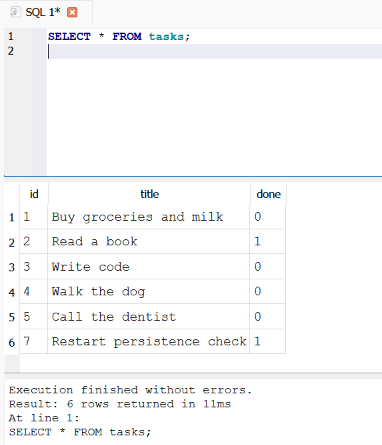
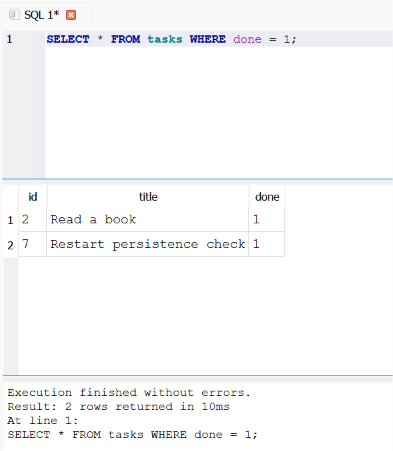
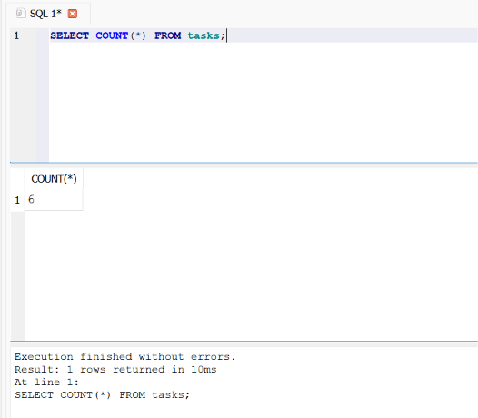
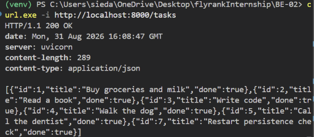
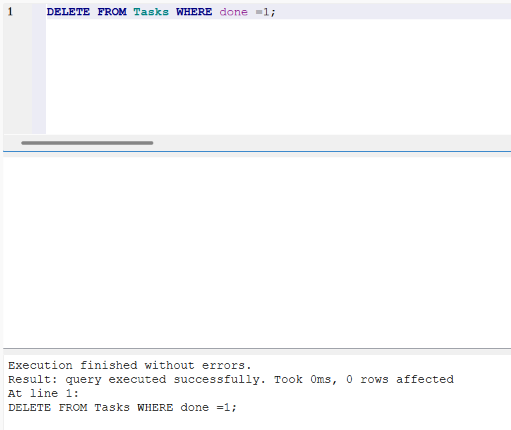
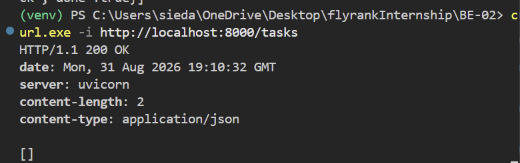

# Task CRUD API — SQLite Edition

A simple task management API built with FastAPI, backed by a real SQLite
database. This is the Week 3 evolution of a Week 1 in-memory CRUD API —
same endpoints, same request/response shapes, but now the data survives
a server restart.

## Why SQLite

- **Single file** — the entire database is one file (`tasks.db`), no
  separate database server to install, configure, or run.
- **Zero setup** — Python's built-in `sqlite3` module needs no extra
  install. Opening a connection to a file that doesn't exist yet creates
  it automatically.
- **Survives restarts** — unlike an in-memory Python list, data written
  to `tasks.db` is still there the next time the app starts.

This makes SQLite ideal for small projects and local development; larger
production apps with many concurrent users would typically graduate to
something like PostgreSQL, but the API layer wouldn't need to change at
all — only the storage layer would.

## Where the database lives

The database file is `tasks.db`, created automatically the first time the
app runs — you never create it by hand. It's listed in `.gitignore`, so
it's **not** committed to this repo: every fresh clone starts with no
database file, and the app creates and seeds it on first startup.

## Running the project

```bash
python -m venv venv
source venv/bin/activate      # Windows: venv\Scripts\activate
pip install -r requirements.txt
uvicorn main:app --reload
```

The server starts at `http://localhost:8000`. On first run, `tasks.db` is
created automatically with a `tasks` table and 3 seeded example tasks.
Restarting the app does **not** duplicate the seed data — it only seeds
when the table is empty.

## Endpoints

| Method | Path             | Description                        |
|--------|------------------|-------------------------------------|
| GET    | `/tasks`         | List all tasks                      |
| GET    | `/tasks/{id}`    | Get one task by id                  |
| POST   | `/tasks`         | Create a task (`{"title": str}`)    |
| PUT    | `/tasks/{id}`    | Update a task's title and done flag |
| DELETE | `/tasks/{id}`    | Delete a task                       |

All endpoints behave identically to the original in-memory version —
same status codes (`200`, `201`, `204`, `400`, `404`), same JSON shapes.
Only the storage underneath changed, from a Python list to SQL queries
against `tasks.db`.

## Exploring the database directly (Stage 4)

Opening `tasks.db` in [DB Browser for SQLite](https://sqlitebrowser.org/)
lets you run SQL by hand against the exact same file the API reads and
writes. Changes made in DB Browser show up instantly through the API,
with no restart needed — there's no "syncing," just one file both tools
read from.

**Example query run by hand:**

```sql
UPDATE tasks SET done = 1;
```

This marked every task in the table as completed in a single statement —
a good reminder that a query without a `WHERE` clause affects *every*
row, not just one.








## Safety: parameterized queries

Every query that includes user input (an `id`, a `title`) uses a `?`
placeholder with the value passed separately — never glued directly into
the SQL string. This is what prevents SQL injection: user input is
always treated as data, never as part of the query itself.

```python
conn.execute("SELECT * FROM tasks WHERE id = ?", (task_id,))
```

## Project structure

```
.
├── main.py           # FastAPI app + SQLite storage layer
├── requirements.txt  # Python dependencies
├── .gitignore         # excludes venv/, tasks.db, __pycache__/
├── screenshots/       # DB Browser + API screenshots for Stage 4
└── README.md
```